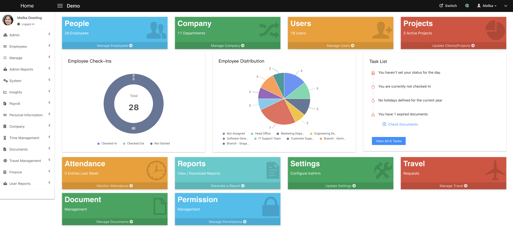
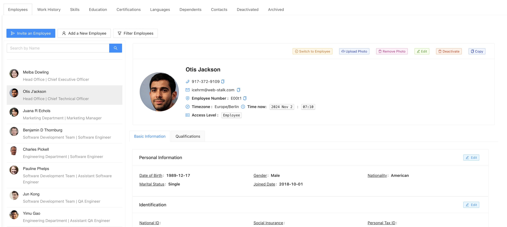

IceHrm
===========
[](https://travis-ci.org/gamonoid/icehrm)

IceHrm is an [HRM software](https://icehrm.com) which enable companies to manage employee details and HR workflows.

- Checkout IceHrm without installing: [IceHrm Demo](https://icehrm.com/icehrm-demo)
- Get a Managed IceHrm hosting: [IceHrm Cloud](https://icehrm.com/icehrm-cloud)
- Self-hosted IceHrm with all the features in IceHrm Cloud: [IceHrmPro](https://icehrm.com/purchase-icehrmpro)


&nbsp;&nbsp;&nbsp;&nbsp;


## Installation

### Using Docker

- Install docker on Mac, Windows or Linux [https://docs.docker.com/get-docker/](https://docs.docker.com/get-docker/)
- Download the [latest version of IceHrm](https://github.com/gamonoid/icehrm/releases/latest) and extract it.
- Alternatively you can cone the repo `git clone https://github.com/gamonoid/icehrm.git`
```
cd icehrm
npm run setup
npm run docker:build
npm run docker:start
```


- Visit [http://localhost:3128/](http://localhost:3128/) and login using `admin` as username and password.
- Visit [http://localhost:3130/](http://localhost:3130/) to access phpmyadmin.
- All user uploaded files are stored under `icehrm/docker/production/app_data`

### Installation (without docker)
- Please check [Installation guide](https://icehrm.com/explore/docs/installation/).

### Upgrade from Previous Versions

- Download the [latest release](https://github.com/gamonoid/icehrm/releases/latest).
- Extract the release file.
- Replace the `icehrm/core` directory in your current installation.
- Replace the `icehrm/web` directory in your current installation.
- Copy or replace `icehrm/updater` in your current installation.
- From `icehrm/app` directory in release, copy and replace following files in your installtion `icehrm/app` directory:
  - fileupload-new.php
  - fileupload_page.php
  - google-connect.php
  - updater.php

## Setup Development Environment
```
git clone https://github.com/gamonoid/icehrm.git
cd icehrm
docker compose up -d
```
- Visit [http://localhost:9010/](http://localhost:9010/) and login using `admin` as username and password.
- Watch this for more detailed instructions: [https://www.youtube.com/watch?v=sz8OV_ON6S8](https://www.youtube.com/watch?v=sz8OV_ON6S8)

### Extend IceHrm with custom Extensions
- Inorder to create an admin extension run
```
php ice create:extension sample admin
```


- Refresh IceHrm to see a new menu item called `Sample Admin`
- The extension code can br found under `icehrm/extensions/sample/admin`
- Refer: [https://icehrm.com/explore/docs/extensions/](https://icehrm.com/explore/docs/extensions/) for more details.

### Building frontend assets

- When ever you have done a change to JavaScript or CSS files in icehrm/web you need to rebuild the frontend
- First make sure you have all the dependencies (just doing this once is enough)
```
cd icehrm/web
npm install
cd ..
npm install
```

- Build assets during development
```
gulp clean
gulp
```

- Build assets for production
```
gulp clean
gulp --eprod
```

- Build extensions
```
gulp ejs --xextension_name/admin
```

### Debugging code with psysh
You can run psysh inside the icehrm web docker container to manually debug the code.
- Start Psysh console
``` 
docker compose up -d
docker exec -it icehrm-icehrm-1 /bin/sh
./psysh -c ./.config/psysh/config.php
```
This will open a psysh console. You can instantiate any IceHrm class and debug it.
Here is an example of creating an employee object and loading an employee from the database.
```
$emp = new \Employees\Common\Model\Employee();
$emp->Load('id = ?',[1]);
var_dump($emp);
```

### Running tests (Docker)

- Run e2e (cypress) tests

```
docker compose -f docker-compose-testing.yaml up --exit-code-from cypress
```
or
```
docker compose -f docker-compose-testing.yaml up --exit-code-from cypress --build --force-recreate
```

- When you are ready to push your changes to production, make sure to build the production images
```
docker compose -f docker-compose-prod.yaml up -d --build
```

### Useful Links
* IceHrm Opensource Blog: [http://icehrm.org](http://icehrm.org)
* IceHrm Cloud Hosting: [https://icehrm.com](https://icehrm.com)
* IceHrm Documentation (Opensource and Commercial): [https://icehrm.com/explore/docs/](https://icehrm.com/explore/docs/)
* IceHrm Blog: [https://icehrm.com/blog](http://icehrm.com/blog)
* Purchase IceHrm Pro: [https://icehrm.com/modules.php](https://icehrm.com/modules.php)
* Report Issues: [https://github.com/gamonoid/icehrm/issues](https://github.com/gamonoid/icehrm/issues)
